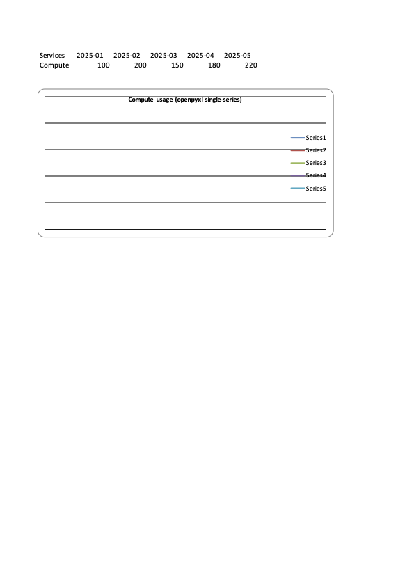
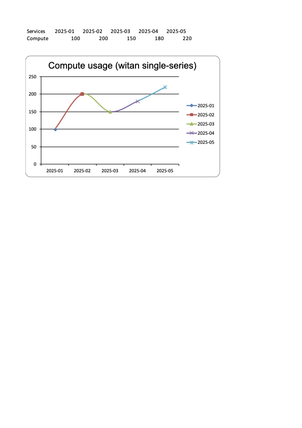

# witan xlsx exec vs openpyxl — 14 reproducible test cases

> [!NOTE]
> **Scope.** A handful of examples showing places where `witan xlsx exec` has
> wider Excel compatibility than `openpyxl` when an agent is asked to perform
> a realistic Excel task. **Not** a comprehensive feature list or bug list of
> either library — just some concrete cases reproduced end-to-end.

All cases tested 2026-04-20 against witan CLI 0.9.0 (API v2.20.0),
openpyxl 3.1.5, xlwings 0.35.1, and Microsoft Excel for Mac
(macOS Darwin 25.3.0). Excel is used only as ground truth via xlwings
automation. Python is launched via `uv run --with openpyxl --with xlwings python …`.

All fixtures, scripts, and outputs live under `~/dev/witan-vs-openpyxl/`.

## Summary

| # | Task | openpyxl | witan |
|---|------|----------|-------|
| 1 | What-if on an NPV formula | ✗ returns `None` (cached values wiped on save) | ✓ correct 68407.85 |
| 2 | Iterative calc after input change | ✗ returns `None` for every circular cell | ✓ correct 35000 |
| 3 | Read a legacy `.xls` file | ✗ `InvalidFileException` | ✓ auto-converts and reads |
| 4 | Round-trip threaded comments | ✗ silent data loss (`threadedcomments/` stripped) | ✓ all parts preserved |
| 5 | Write `=UNIQUE(FILTER(...))` dynamic array | ✗ Excel repair prompt removes the formula | ✓ spill evaluates correctly |
| 6 | Add a single-series LineChart | ✗ emits 5 phantom `<ser>` elements | ✓ single correct series |
| 7 | Parse / evaluate `A1#` spill reference | ✗ `Tokenizer` raises `TokenizerError` on `#` | ✓ evaluates directly |
| 8 | Describe and extend a What-If Data Table | ✗ no API; blind writes silently break the table | ✓ structured `getDataTable`/`addDataTable` |
| 9 | Conditional format over a discontiguous range | ✗ documented path crashes in `save()` | ✓ single rule with discontiguous `address` |
| 10 | Rename a sheet referenced by formulas | ✗ formulas still say `=Inputs!…` after rename | ✓ every reference rewritten |
| 11 | Insert a row above data used by formulas | ✗ all formulas stale; wrong values, no warning | ✓ formulas, named ranges, array-formula `ref` all shifted |
| 12 | Rich text with a whitespace-only run | ✗ Excel repair removes the whitespace runs | ✓ `xml:space="preserve"` set on every whitespace run |
| 13 | Overlapping cell merges | ✗ serialises both; Excel repair removes **all** merges | ✓ deduplicates; file opens cleanly with one merge |
| 14 | Read per-cell borders inside a merge | ✗ returns garbled/hallucinated borders; colors zeroed, sides swapped | ✓ returns each cell's actual XML border |

Key: ✓ works · ✗ fails.

## Failure classes

Grouped by the *kind* of failure each case surfaces on the openpyxl side:

- **Silent wrong answer** (agent reports without any error signal) — 1, 2, 4, 11, 14
- **Cannot complete the task at all** (hard error, crash, or missing API) — 3, 6, 7, 8, 9
- **File requires Excel repair** (produced file flagged as corrupt) — 5, 12, 13
- **Broken XML or structure** (file loads but is semantically wrong) — 6, 10, 11

---

## Environment

- Working dir: `~/dev/witan-vs-openpyxl/`
- Python launcher: `uv run --with xlwings --with openpyxl python <script>`
- witan CLI: `0.9.0`, using production API (`WITAN_API_KEY` in env)
- Excel: Microsoft Excel for Mac
- Fixtures built in this session live in `fixtures/`.

xlwings automation on macOS has one limitation that only matters for Case 2:
the AppleScript bridge does not run Excel's iterative solver on
`app.calculate()`, so validation of iterative outputs has to go through
witan's cached values (which Excel then reads correctly). Called out
explicitly inside that case.

---

## Case 1 — What-if on a formula-driven NPV

**Verdict**
- openpyxl — **✗** After the input change, `data_only=True` returns `None` (save wipes cached values); `data_only=False` returns the formula string. No way to report the new NPV.
- witan — **✓** Returns 68407.85, matching Excel.

**Fixture:** `fixtures/pricing.xlsx`. Built with openpyxl then opened in Excel
(via xlwings) to cache the NPV @ 8% before any test. Script:
`scripts/case1_build_fixture.py`.

Schema:
- `Assumptions!B5` = 0.08 (discount rate)
- `Cashflows!B2:B12` = initial outlay + 10 years of flows
- `Summary!E23` = `=Cashflows!B2 + NPV(Assumptions!B5, Cashflows!B3:B12)`

Baseline (cached by Excel): `Summary!E23 = 104049.83`.

**Prompt:**
> In `pricing.xlsx`, change the discount rate on `Assumptions!B5` from 8% to
> 12% and report the new NPV from `Summary!E23`.

### openpyxl

```python
wb = openpyxl.load_workbook(DST)
wb["Assumptions"]["B5"] = 0.12
wb.save(DST)

wb2 = openpyxl.load_workbook(DST, data_only=True)
print(wb2["Summary"]["E23"].value)  # None
```

```
openpyxl reports Summary!E23 = None (data_only=True, cached)
openpyxl formula string       = '=Cashflows!B2 + NPV(Assumptions!B5, Cashflows!B3:B12)'
```

Opening the saved file in Excel afterwards does recompute:

```
  Summary!E23 = 68407.84549902589
```

…but openpyxl itself cannot hand the agent an answer without a third-party
formula evaluator (`formulas`, `koala2`) with its own function gaps.

### witan

```javascript
const before = await xlsx.readCell(wb, "Summary!E23")
const r = await xlsx.setCells(wb, [{address:"Assumptions!B5", value:0.12}])
return {
  before_npv: before.value,
  after_npv: r.touched["Summary!E23"],
  errors: r.errors,
}
```

```json
{ "before_npv": 104049.83, "after_npv": "68407.8455", "errors": [] }
```

Matches Excel to the cent.

---

## Case 2 — Iterative calculation over a circular reference

**Verdict**
- openpyxl — **✗** No iterative solver; every circular-dependent cell returns `None` after a save.
- witan — **✓** `setCells` runs the iterative loop and returns 35000.

**Fixture:** `fixtures/circular.xlsx`. Built entirely with witan
(`scripts/case2_witan_build.js`) so iterative-calc state is correctly seeded
into the cached `<v>` values.

- `Inputs!B1..B4` = Revenue 100000, Opex ratio 0.4, Tax rate 0.3, Bonus rate 0.1
- `Model!B3` = `=B1 - B2 - B4` (profit before bonus)
- `Model!B4` = `=B3 * Inputs!B4` (bonus, **circular on B3**)
- `Model!B7` = `=B5 - B6` (net income)

Baseline (witan-cached, Excel-verified): `Model!B7 = 38181.82`.

**Prompt:**
> In `circular.xlsx`, change the bonus rate on `Inputs!B4` from 10% to 20%
> and report the new net income from `Model!B7`.

Analytic answer: `B3 = 100000 - 40000 - 0.2·B3` → `B3 = 50000`, tax = 15000,
**B7 = 35000**.

### openpyxl

```python
wb = openpyxl.load_workbook(DST)
wb["Inputs"]["B4"] = 0.2
wb.save(DST)
wb2 = openpyxl.load_workbook(DST, data_only=True)
print(wb2["Model"]["B7"].value)
```

```
openpyxl Model!B7 (net income)  = None
openpyxl Model!B3 (profit)      = None
openpyxl Model!B4 (bonus)       = None
```

Every circular-dependent cell comes back `None`. Opening the saved file
through xlwings on macOS still reports `None` because AppleScript automation
does not drive iterative calc. A human user pressing F9 in the Excel GUI
would eventually converge; the agent cannot.

### witan

```javascript
const r = await xlsx.setCells(wb, [{address:"Inputs!B4", value:0.2}])
return {
  after_net_income: r.touched["Model!B7"],
  profit: r.touched["Model!B3"],
  bonus: r.touched["Model!B4"],
  errors: r.errors,
}
```

```json
{ "after_net_income": "35000", "profit": "50000", "bonus": "9999.999999", "errors": [] }
```

Saving with `--save` and re-opening in Excel returns the same cached value
(`Model!B7 = 34999.9999`), confirming witan's solver and the cached file agree.

**Note:** the fixture must be built by Excel or witan, not openpyxl. openpyxl
writes iterative-model formula cells with an empty `<v/>` tag that Excel
interprets as "already computed to blank", which prevents iteration from
starting — the whole file renders `None` everywhere.

---

## Case 3 — Read a legacy `.xls` file

**Verdict**
- openpyxl — **✗** Raises `InvalidFileException`; cannot read `.xls` at all.
- witan — **✓** Auto-converts `.xls` → `.xlsx` server-side and reads normally.

**Fixture:** `fixtures/formulas.xls` (copied from
`../witan-alfred/fixtures/xls/formulas.xls`). 3-row × 4-column table with
formulas in columns C and D.

**Prompt:**
> Read `Sheet1` (or the first sheet) from `formulas.xls` and report cell B3.

### openpyxl

```python
wb = openpyxl.load_workbook(PATH)
```

```
FAIL (InvalidFileException): openpyxl does not support the old .xls file
format, please use xlrd to read this file, or convert it to the more
recent .xlsx file format.
```

`xlrd ≥ 2.0` reads cached values only; writing back requires `xlwt`
(unmaintained since 2020), and no Python library round-trips `.xls`
formulas cleanly.

### witan

```bash
$ witan xlsx exec fixtures/formulas.xls --expr \
  'xlsx.readCell(wb, {sheet:(await xlsx.listSheets(wb))[0].sheet, row:3, col:2})'
```

```json
{ "address": "Formulas!B3", "value": 4, "text": "4", "type": "number", "format": "General" }
```

Ranged reads expose both values and formulas:

```
$ witan xlsx exec fixtures/formulas.xls --expr 'xlsx.readRangeTsv(wb, {sheet:"Formulas", from:{row:1,col:1}, to:{row:5,col:4}}, {includeFormulas:true})'

"A1|Value1   B1|Value2   C1|Formula   D1|Result
 A2|10       B2|5        C2|15|=A2+B2 D2|15|=A2+B2
 A3|20       B3|4        C3|80|=A3*B3 D3|80|=A3*B3
 A4|100      B4|10       C4|10|=A4/B4 D4|10|=A4/B4"
```

---

## Case 4 — Threaded comments

**Verdict**
- openpyxl — **✗** Sees existing threads as an opaque warning stub only; on save, silently deletes the `threadedcomments/` and `persons/` parts. Cannot author a threaded comment.
- witan — **✓** Round-trips all parts; `readCell().thread` returns author, text, and `resolved` state.

**Fixture:** `fixtures/review.xlsx`. Built with witan
(`scripts/case4_build.js`), contains two threaded comments: one resolved
("Initial balance confirmed" by Reviewer A on `Data!B2`) and one open
("Needs follow-up on Q3 close" by Reviewer B on `Data!C2`). File parts:

```
xl/comments1.xml
xl/threadedcomments/threadedcomment.xml
xl/persons/person.xml
```

**Prompt:**
> In `review.xlsx`, add a resolved threaded comment on `Data!B3` saying
> "Verified against ledger" by author "Auditor", then list every threaded
> comment in the workbook with author, text, and resolved state.

### openpyxl

```python
from openpyxl.comments import Comment
wb = load_workbook(DST)
ws = wb["Data"]
print(ws["B2"].comment)        # warning stub text only
ws["B3"].comment = Comment("Verified against ledger", "Auditor")   # legacy note, not a thread
wb.save(DST)
```

openpyxl's view of the fixture's threaded comments:

```
B2.comment = Comment: This comment reflects a threaded comment in this cell,
a feature that might be supported by newer versions of your spreadsheet
program (for example later versions of Excel). Any edits will be overwritten
if opened in a spreadsheet program that supports threaded comments.
Initial balance confirmed by tc={…}
```

openpyxl sees the thread text but has no concept of resolved state or author
identity, and its own warning prefix admits "you can't edit this."

**After save**, file parts:

```
xl/comments/comment1.xml
xl/drawings/commentsDrawing1.vml
```

`threadedcomments/` and `persons/` are gone. Excel's view
(`xlwings → rng.note`):

```
B2.note.text = None
C2.note.text = None
B3.note.text = 'Verified against ledger'
```

Both original threaded comments are erased; only the legacy note openpyxl
wrote on B3 remains.

### witan

```javascript
await xlsx.setCells(wb, [
  {address:"Data!B3", thread:{add:[{author:"Auditor", text:"Verified against ledger"}], resolved:true}},
])
```

After `--save`, `outputs/case4_witan.xlsx` retains all three OOXML parts.
Re-reading returns all three threads with correct `resolved` state and
`createdAt`.

---

## Case 5 — Dynamic array spill (`=UNIQUE(FILTER(...))`)

**Verdict**
- openpyxl — **✗** Writes a plain `<f>…</f>` with no dynamic-array metadata; Excel prompts for repair and strips the formula.
- witan — **✓** Emits `<f t="array" ref="D2:D5" cm="1">` with spill metadata; Excel opens the file cleanly and the spill evaluates.

**Fixture:** `fixtures/report.xlsx`. Built with witan
(`scripts/case5_build.js`). Raw sheet has 12 rows of `(category, amount)`
transactions; Summary sheet is empty.

**Prompt:**
> In `report.xlsx`, put `=UNIQUE(FILTER(Raw!A2:A13, Raw!B2:B13>0))` into
> `Summary!D2` as a dynamic array so it spills down. Return the spilled values.

Analytic answer: categories whose row has positive amount →
`Food`, `Rent`, `Supplies`, `Travel`.

### openpyxl

```python
wb = load_workbook(DST)
wb["Summary"]["D2"] = "=UNIQUE(FILTER(Raw!A2:A13, Raw!B2:B13>0))"
wb.save(DST)
```

Reading back in openpyxl, D2 just holds the formula string; D3…D10 are blank.

**Opening in Excel** triggers the repair dialog. Repair log:

```
Repair Result to case5_openpyxl0.xml
Errors were detected in file '.../case5_openpyxl.xlsx'
Removed Records: Formula from /xl/worksheets/sheet2.xml part
```

Excel strips the UNIQUE/FILTER formula during repair. Post-repair
`Summary!D2:D7` are all empty. The agent's formula is gone; the user has to
rewrite it. (`xlwings` with `display_alerts=False` returns OSERROR -50 because
it can't dismiss the repair modal.)

The root cause: Excel's dynamic array formulas require
`<f t="array" ref="D2:D5" cm="…">`; plain openpyxl just writes `<f>=UNIQUE(...)</f>`.

### witan

```javascript
await xlsx.setCells(wb, [
  {address:"Summary!D2", formula:"=UNIQUE(FILTER(Raw!A2:A13, Raw!B2:B13>0))"},
])
```

`witan xlsx exec --script --save` output:

```json
{
  "tsv": "D2|Food\nD3|Rent\nD4|Supplies\nD5|Travel",
  "values": ["Food", "Rent", "Supplies", "Travel", null, null, null, null, null]
}
```

Excel verification (no repair dialog):

```
  D2: value='Food'     formula='=UNIQUE(FILTER(Raw!A2:A13, Raw!B2:B13>0))'
  D3: value='Rent'     formula=''
  D4: value='Supplies' formula=''
  D5: value='Travel'   formula=''
```

D3–D5 have values with empty formula strings — Excel's signature for
correctly-spilled dynamic array cells.

---

## Case 6 — Single-series LineChart

**Verdict**
- openpyxl — **✗** The documented MRE emits five `<c:ser>` elements (one per column of a row-shaped `Reference`), each with a single data point. Excel renders five phantom `Series1…Series5` on a flat line.
- witan — **✓** Emits one `<c:ser>` with `cat` = months and `val` = data. Excel renders the expected single line 100 → 200 → 150 → 180 → 220.

Traced to the openpyxl tracker: *Single Series LineChart Misinterprets
Category Axis (openpyxl apparently emits incomplete chart XML)*.

**Prompt:**
> Build a workbook with one row of data (`Compute` across five months) and add
> a LineChart that shows it as one line against the months as category labels.

### openpyxl

`scripts/case6_openpyxl.py`, straight from the issue's MRE:

```python
from openpyxl.chart import LineChart, Reference

wb = Workbook(); ws = wb.active; ws.title = "Data"
ws.append(["Services", "2025-01", "2025-02", "2025-03", "2025-04", "2025-05"])
ws.append(["Compute",  100,        200,        150,        180,        220])

chart = LineChart()
chart.title = "Compute usage (openpyxl single-series)"
cats = Reference(ws, min_col=2, max_col=6, min_row=1)
vals = Reference(ws, min_col=2, max_col=6, min_row=2)
chart.add_data(vals, titles_from_data=False)
chart.set_categories(cats)
ws.add_chart(chart, "A5")
wb.save(OUT)
```

The chart XML:

```
$ unzip -p outputs/case6_openpyxl.xlsx xl/charts/chart1.xml | grep -oE '<ser>' | wc -l
5
```

Each "series" has exactly one datum (`$B$2`, `$C$2`, `$D$2`, `$E$2`, `$F$2`).
Excel rendering (`outputs/case6_openpyxl_excel.png`): flat line at y = 0,
legend listing `Series1 … Series5`, data values not plotted.



### witan

```javascript
await xlsx.addChart(wb, "Data", {
  name: "Compute",
  position: {from:{cell:"A5"}, to:{cell:"H22"}},
  title: {text: "Compute usage (witan single-series)"},
  legend: {position: "right"},
  groups: [{
    type: "line",
    series: [{
      name: {ref: "Data!A2"},
      categories: "Data!B1:F1",
      values: "Data!B2:F2",
    }],
  }],
})
```

Structural result from `xlsx.listCharts(wb)`:

```json
{"name":"Compute","type":"line","groupCount":1,"seriesCount":1}
```

Exactly one `<c:ser>` whose `cat` points at `Data!B1:F1` and `val` at
`Data!B2:F2`. Excel rendering (`outputs/case6_witan_excel.png`): the correct
single line 100 → 200 → 150 → 180 → 220.



Note: Excel for Mac adds per-point marker variety in the legend of a
single-series line chart; this cosmetic quirk is independent of the openpyxl
bug. The structural distinction — **5 series vs 1** — is the point.

---

## Case 7 — Parsing a spill-reference formula (`A1#`)

**Verdict**
- openpyxl — **✗** `openpyxl.formula.Tokenizer` raises `TokenizerError: Unexpected character at position N` on the `#` in every spill reference. Any programmatic handling (translate, range-shift, validate) therefore fails.
- witan — **✓** Parses and evaluates `=COUNTA(D2#)`, `=COUNTIF(D2#, "Food")`, `=TEXTJOIN(", ", TRUE, D2#)` directly.

Traced to the openpyxl tracker: *Tokenizer does not regocognize spill
reference es A1# or $A$1#*.

**Fixture:** `fixtures/report_spillref.xlsx` (`scripts/case7_build.js`) —
extends the Case 5 fixture with three consumer formulas:

| Cell         | Formula                                   |
|--------------|-------------------------------------------|
| `Summary!D2` | `=UNIQUE(FILTER(Raw!A2:A13, Raw!B2:B13>0))` (spills D2:D5) |
| `Summary!F2` | `=COUNTA(Summary!D2#)`                    |
| `Summary!G2` | `=COUNTIF(Summary!D2#, "Food")`           |
| `Summary!H2` | `=TEXTJOIN(", ", TRUE, Summary!D2#)`      |

**Prompt:**
> Inspect the formulas on `Summary!F2`, `G2`, `H2` and report what each one
> computes. Then evaluate each formula.

### openpyxl

```python
from openpyxl import load_workbook
from openpyxl.formula import Tokenizer

wb = load_workbook(SRC)
ws = wb["Summary"]
for addr in ("F2", "G2", "H2"):
    f = ws[addr].value
    Tokenizer(f)     # ← raises
```

Load succeeds, formula strings survive on cells (`F2.value =
'=COUNTA(Summary!D2#)'`), but tokenization fails:

```
F2: Tokenizer FAIL (TokenizerError): Unexpected character at position 18 in '=COUNTA(Summary!D2#)'
G2: Tokenizer FAIL (TokenizerError): Unexpected character at position 19 in '=COUNTIF(Summary!D2#, "Food")'
H2: Tokenizer FAIL (TokenizerError): Unexpected character at position 38 in '=_xlfn.TEXTJOIN(", ", TRUE, Summary!D2#)'
```

Because `Tokenizer` is the foundation for `Translator`, row/col-shift,
find-and-replace, etc., every downstream operation fails. The only thing
that works is a byte-level passthrough (formula string survives save
unchanged).

### witan

The fixture itself is authored by witan, so it also exercises the write path.
The `A1#` operator lowers to the canonical OOXML `_xlfn.ANCHORARRAY(...)`
encoding in the saved XML:

```xml
<x:c r="F2"><x:f>COUNTA(_xlfn.ANCHORARRAY(Summary!D2))</x:f><x:v>4</x:v></x:c>
<x:c r="G2"><x:f>COUNTIF(_xlfn.ANCHORARRAY(Summary!D2), "Food")</x:f><x:v>1</x:v></x:c>
<x:c r="H2"><x:f>_xlfn.TEXTJOIN(", ", TRUE, _xlfn.ANCHORARRAY(Summary!D2))</x:f>...</x:c>
```

Reads round-trip the user-facing `#` syntax:

```bash
$ witan xlsx exec fixtures/report_spillref.xlsx \
    --expr 'xlsx.readRangeTsv(wb, "Summary!D1:H5", {includeFormulas:true})'

"D1|Unique pos cats   F1|Count  G1|Food matches   H1|Joined
 D2|Food|=UNIQUE(...) F2|4|=COUNTA(Summary!D2#)  G2|1|=COUNTIF(Summary!D2#, \"Food\")  H2|Food, Rent, Supplies, Travel|=TEXTJOIN(\", \", TRUE, Summary!D2#)"
```

`evaluateFormula` accepts the same syntax directly:

```bash
$ witan xlsx exec fixtures/report_spillref.xlsx \
    --expr 'xlsx.evaluateFormulas(wb, "Summary", ["=COUNTA(D2#)", "=COUNTIF(D2#, \"Food\")", "=TEXTJOIN(\", \", TRUE, D2#)"])'
# → [4, 1, "Food, Rent, Supplies, Travel"]
```

---

## Case 8 — What-If Data Table: describe and extend

**Verdict**
- openpyxl — **✗** No public API; the table shows up only as a `DataTableFormula` object with undocumented private `__dict__` attributes, and axis input values live in `<extLst>` which openpyxl never parses. Extending a table by writing new cells silently fails — the array-formula ref stays unchanged.
- witan — **✓** `getDataTable` returns structured metadata including axes and input values; `deleteDataTable` + `addDataTable` rebuilds a correctly-extended table.

Traced to the openpyxl tracker: *Data Table is missing after load_workbook*.

**Fixture:** `fixtures/sensitivity2d.xlsx`. 2-variable What-If Data Table on
`Model!D1:I6`:

- **Formula cell** `D1` = `=B5` (Profit)
- **Row axis** (volumes): `E1:I1` = 500, 750, 1000, 1250, 1500 → `B2`
- **Column axis** (prices): `D2:D6` = 40, 50, 60, 70, 80 → `B1`
- Inside `E2:I6` a single array formula
  `<f t="dataTable" ref="E2:I6" dt2D="1" r1="B1" r2="B2">`

**Prompt A:**
> Describe the What-If Data Table on `Model!D1:I6`: what input cells does it
> vary, what formula does it compute, and what values does each axis test?

**Prompt B:**
> Extend the data table to include a new price axis value of 90, so it
> computes profit for prices 40..90 across volumes 500..1500.

### openpyxl — Prompt A (describe)

```
=== Public data-table-ish attributes on Worksheet ===
  ws._pivots, ws._tables, ws.add_table, ws.tables   # ← ListObjects / pivots only

=== ws.tables (ListObjects) ===
  count = 0

=== Private data_table attrs ===
  ws.data_tables: not found
  ws._data_tables: not found

=== Inspect formula cells ===
  E2: value = <openpyxl.worksheet.formula.DataTableFormula object at 0x…>
    attrs = {'ref':'E2:I6', 'ca':'1', 'dt2D':'1', 'dtr':False,
             'r1':'B1', 'r2':'B2', 'del1':False, 'del2':False}
```

No public API. `ws.tables` covers ListObjects only. An agent must iterate
cells, type-check for `DataTableFormula`, then read private `__dict__` attrs
whose meaning is not documented. The **axis input values** (500, 750, …;
40, 50, …) live in `<extLst>` → `<x14:dataTable>` which openpyxl does not
parse into objects — unreachable without reading raw XML.

### witan — Prompt A (describe)

```javascript
const sheets = await xlsx.listSheets(wb)
for (const s of sheets.filter(s => s.dataTables?.length))
  for (const ref of s.dataTables) out.push(await xlsx.getDataTable(wb, ref))
```

```json
[{
  "type": "twoVariable",
  "sheet": "Model",
  "ref": "Model!D1:I6",
  "dataTableRange": "Model!E2:I6",
  "formula": "=B5",
  "rowInputCell":    "Model!B2",  "rowInputValues":    [500, 750, 1000, 1250, 1500],
  "columnInputCell": "Model!B1",  "columnInputValues": [40, 50, 60, 70, 80]
}]
```

Every piece of information in the prompt is structured and addressable.

### openpyxl — Prompt B (extend)

```python
ws["D7"] = 90     # new price label
wb.save(DST)
```

No warning, no error. But the array formula at `E2` keeps its original ref:

```
DataTableFormula ref after save = {'ref': 'E2:I6', 'dt2D':'1', 'r1':'B1', 'r2':'B2', ...}
```

Opening in Excel:

```
Model!D7 = 90.0
Model!E7 = None
Model!I7 = None
```

The new row is **not part of the data table**. Silent failure.

### witan — Prompt B (extend)

```javascript
const before = await xlsx.getDataTable(wb, "Model!D1:I6")
await xlsx.deleteDataTable(wb, "Model!D1:I6")
await xlsx.addDataTable(wb, "Model", {
  type: "twoVariable",
  ref: "D1:I7",
  rowInputCell: before.rowInputCell.split("!")[1],
  columnInputCell: before.columnInputCell.split("!")[1],
  rowInputValues: before.rowInputValues,
  columnInputValues: [...before.columnInputValues, 90],
  formula: before.formula,
})
```

After `--save`, Excel reads:

```
Model!D7 = 90.0
Model!E7 = 37300.0     (profit at price=90, volume=500)
Model!I7 = 127300.0    (profit at price=90, volume=1500)
Model!G4 = 53200.0     (unchanged — price=60, volume=1000)
```

The table correctly extends to 6 prices × 5 volumes.

---

## Case 9 — Conditional formatting over a discontiguous range

**Verdict**
- openpyxl — **✗** The documented path to a discontiguous CF rule raises a `TypeError` pointing at `MultiCellRange`; the `MultiCellRange` path then crashes deep in `save()` with `AttributeError`. Only an undocumented space-separated string works.
- witan — **✓** A single rule with a discontiguous `address` ("A1:A10 D1:D10"); serialises as `<conditionalFormatting sqref="A1:A10 D1:D10">` and opens cleanly in Excel.

Traced to the openpyxl tracker: *Conditional Formatting Rule with
MultiCellRange dies on save*.

**Prompt:**
> On the Data sheet, highlight cells in ranges `A1:A10` and `D1:D10` whose
> value is greater than 100, using the same yellow fill.

### openpyxl

Three paths a user would try, in order:

```
Path 1: add_conditional_formatting("A1:A10,D1:D10", rule)
  → TypeError: expected <class 'openpyxl.worksheet.cell_range.MultiCellRange'>

Path 2: MultiCellRange([CellRange("A1:A10"), CellRange("D1:D10")])
  → AttributeError: 'MultiCellRange' object has no attribute 'to_tree'
    (raised inside wb.save() from openpyxl/writer/excel.py)

Path 3: add_conditional_formatting("A1:A10 D1:D10", rule)
  → succeeds; sqref in output XML is "A1:A10 D1:D10"
```

Path 1's error points the user at `MultiCellRange`. Path 2, the one the
error message instructs, crashes at save. Path 3 works but is discoverable
only by trial: space-separated ranges aren't in the documented examples and
the `TypeError` does not mention them.

Full repro: `scripts/case9_openpyxl.py`.

### witan

witan's `setConditionalFormatting` accepts a discontiguous `address` directly,
matching Excel's native `sqref` syntax (space- or comma-separated union).
One rule, one call:

```javascript
await xlsx.setConditionalFormatting(wb, "Data", [{
  type: "cellValue",
  address: "A1:A10 D1:D10",
  operator: "greaterThan",
  formula: "100",
  style: {fill: {color: "#FFFF00"}},
}], {clear: true})
```

`xlsx.getConditionalFormatting(wb, "Data")`:

```json
[
  {"index":0, "type":"cellValue", "address":"A1:A10,D1:D10", "operator":"greaterThan", "formula":"100", "style":{"fill":{"color":"#FFFF00"}}, "priority":1}
]
```

Saved XML has the expected native form:

```xml
<x:conditionalFormatting sqref="A1:A10 D1:D10">
  ...
</x:conditionalFormatting>
```

File opens cleanly in Excel; the highlight applies to both ranges under a
single rule.

---

## Case 10 — Sheet rename with formula rewriting

**Verdict**
- openpyxl — **✗** `ws.title = "…"` renames the sheet in `workbook.xml` but leaves every formula string, defined-name target, and array-formula source range pointing at the old name. Excel returns `None` for every formula cell.
- witan — **✓** `renameSheet` rewrites formula strings, defined-name targets, and array-formula source ranges.

Traced to the openpyxl tracker: *Sheet Renaming Issue*.

**Fixture:** `fixtures/rename.xlsx` (`scripts/case10_build.js`):

| Sheet    | Cell | Formula                   | Purpose                   |
|----------|------|---------------------------|---------------------------|
| Inputs   | B1–B5| values (100, 200, 150, 300) | driven data             |
| Summary  | B1   | `=Inputs!B2 + Inputs!B3`  | single-cell refs          |
| Summary  | B2   | `=SUM(Inputs!B2:B5)`      | range ref                 |
| Summary  | B3   | `=InputsBeta` (named, → `Inputs!$B$3`) | named range  |
| Summary  | B4   | `=UNIQUE(Inputs!A2:A5)` (dynamic-array spill) | array formula |

**Prompt:**
> Rename the sheet "Inputs" to "Parameters".

### openpyxl

```python
wb["Inputs"].title = "Parameters"
wb.save(DST)
```

After save, reopened in openpyxl:

```
=== After rename (formula view) ===
  Summary!B1  = '=Inputs!B2 + Inputs!B3'
  Summary!B2  = '=SUM(Inputs!B2:B5)'
  Summary!B3  = '=InputsBeta'
  Summary!B4  = <ArrayFormula ref='B4:B6' text='=_xlfn.UNIQUE(Inputs!A2:A5)'>

=== Defined names ===
  InputsBeta -> 'Inputs!$B$3'
```

Sheet is renamed on disk (`['Parameters', 'Summary']`), but every formula
still references `Inputs!` — a sheet that no longer exists. The defined name
`InputsBeta` also still points at `Inputs!$B$3`.

Excel view:

```
Summary!B1  value=None  formula='=Inputs!B2 + Inputs!B3'
Summary!B2  value=None  formula='=SUM(Inputs!B2:B5)'
Summary!B3  value=None  formula='=InputsBeta'
Summary!B4  value=None  formula='=UNIQUE(Inputs!A2:A5)'
```

All formula cells return `None`. The rename is complete structurally, but the
workbook is unusable.

### witan

```javascript
await xlsx.renameSheet(wb, "Inputs", "Parameters")
```

Return envelope:

```
Summary!B1  =Parameters!B2 + Parameters!B3   → 300
Summary!B2  =SUM(Parameters!B2:B5)            → 750
Summary!B3  =InputsBeta                       → 200      (name retargeted to Parameters!$B$3)
Summary!B4  =UNIQUE(Parameters!A2:A5)         → "alpha"
Summary!B5  =UNIQUE(Parameters!A2:A5)         → "beta"   (spill)
Summary!B6  =UNIQUE(Parameters!A2:A5)         → "gamma"  (spill)
definedNames: [{ name: "InputsBeta", range: "Parameters!$B$3" }]
```

Excel view:

```
Summary!B1  value=300.0  formula='=Parameters!B2 + Parameters!B3'
Summary!B2  value=750.0  formula='=SUM(Parameters!B2:B5)'
Summary!B3  value=200.0  formula='=InputsBeta'
Summary!B4  value='alpha' formula='=UNIQUE(Parameters!A2:A5)'
Summary!B5  value='beta'  formula=''
Summary!B6  value='gamma' formula=''
```

No repair dialog, all values recompute.

---

## Case 11 — Insert a row; shift formulas, named ranges, array-formula `ref`

**Verdict**
- openpyxl — **✗** Documented limitation: `insert_rows` moves cells but does not update formulas. Row-local formulas end up referencing the wrong rows; range formulas don't grow; the array-formula `ref` doesn't extend; named ranges don't extend. No error — values just drift.
- witan — **✓** `insertRowAfter` rewrites row-local formulas, extends ranges, grows the array-formula `ref`, and extends named ranges.

Traced to openpyxl's own docstring:
> *"openpyxl does not manage dependencies, such as formulae, tables, charts,
> nor images … if you use this method to insert rows, any formulae, tables,
> or charts in other rows will not be updated."*

**Fixture:** `fixtures/shift.xlsx` (`scripts/case11_build.js`):

- `Data!A1:B10` — Revenue / Cost table (rows 2..10)
- `Data!C2:C10` — `=A{r}-B{r}` (row-local profit formulas)
- `Data!E2` — `=SUM(A2:A10)` = 5400
- `Data!E3` — `=SUM(B2:B10)` = 2700
- `Data!E4` — `=SUM(C2:C10)` = 2700
- `Data!E5` — `=AVERAGE(A2:A10)` = 600
- `Data!E6` — `=SUM(RevenueRange)` where `RevenueRange = Data!$A$2:$A$10`
- `Data!G2` — `=SORT(A2:A10)` dynamic array, spills `G2:G10`

**Prompt:**
> Insert one row above the current row 5, add a new Revenue = 525, Cost = 250
> in it, and make sure every existing formula still computes correctly for
> the full table.

### openpyxl

```python
ws.insert_rows(5, amount=1)
ws["A5"] = 525
ws["B5"] = 250
wb.save(DST)
```

Excel's view (no repair prompt; formulas are valid but wrong):

| Cell | Formula       | Computed | Intended |
|------|--------------|----------|---------|
| A5   | `525`        | 525      | 525 |
| B5   | `250`        | 250      | 250 |
| C5   | (empty)      | —        | should be `=A5-B5 = 275` |
| C6   | `=A5-B5`     | **275**  | should be `=A6-B6 = 250` |
| C11  | `=A10-B10`   | **450**  | should be `=A11-B11 = 500` |
| E2   | `=SUM(A2:A10)` | **4925** | should be `=SUM(A2:A11) = 5925` |
| E3   | `=SUM(B2:B10)` | **2450** | should be `=SUM(B2:B11) = 2950` |
| E4   | `=SUM(C2:C10)` | **2025** | should be `=SUM(C2:C11) = 2975` |
| E5   | (empty)        | —        | shifted AVERAGE is gone from this row |
| E6   | `=AVERAGE(A2:A10)` | **547.22** | should be `=AVERAGE(A2:A11) = 592.5` |
| G2…G10 | `=SORT(A2:A10)` array | 200…900 | should be `=SORT(A2:A11)` spilling 200…1000 |
| G11  | `1000` (literal!) | 1000 | should be part of the SORT spill |

Every range-reference formula is wrong; every row-local formula is
mis-positioned by one row. `RevenueRange` still says `$A$2:$A$10`. The SORT
spill truncates to 9 rows and openpyxl wrote a literal `1000` at G11.

No repair dialog, so the agent sees no failure signal. The wrong numbers
look plausible (nice round values) — users won't spot that `C11` is off by
50 or that `E2` is 1,000 short.

### witan

```javascript
await xlsx.insertRowAfter(wb, "Data", 4, 1)
await xlsx.setCells(wb, [
  {address:"Data!A5", value:525},
  {address:"Data!B5", value:250},
  {address:"Data!C5", formula:"=A5-B5"},
])
```

Excel's view:

| Cell | Formula          | Computed | Note                           |
|------|------------------|----------|--------------------------------|
| A5/B5 | values 525/250   | 525/250  | new row                        |
| C5    | `=A5-B5`         | 275      | user-supplied, new row profit  |
| C6    | `=A6-B6`         | 250      | was C5, shifted & rewritten    |
| C11   | `=A11-B11`       | 500      | was C10, shifted & rewritten   |
| E2    | `=SUM(A2:A11)`   | 5925     | range extended by 1            |
| E3    | `=SUM(B2:B11)`   | 2950     | range extended by 1            |
| E4    | `=SUM(C2:C11)`   | 2975     | range extended by 1            |
| E5    | (empty)          | —        | the new row's E cell           |
| E6    | `=AVERAGE(A2:A11)` | 592.5  | was E5, both address and range shifted |
| E7    | `=SUM(RevenueRange)` | 5925 | was E6, shifted; named range now `$A$2:$A$11` |
| G2…G11 | `=SORT(A2:A11)` dynamic array | 200…1000 | spill extended; ref now `G2:G11` |

Every formula references the right cells, named-range extended to
`$A$2:$A$11`, dynamic-array `ref` grew from `G2:G10` to `G2:G11` and the
spill covers the full sorted list including the row 11 value of 1000.

### Note on the other three structural ops

openpyxl's own docstring says the same limitation applies to `delete_rows`,
`insert_cols`, and `delete_cols`. Spot checks via
`scripts/case11_variants.py` confirm: every formula still points at pre-edit
addresses, and cached values return `None` for every formula cell that was
either moved or whose range now spans a deleted/inserted line. The
`insert_rows` case above is the most dramatic because of the dynamic array
and the named range; the other three fail in the same shape.

---

## Case 12 — Rich text with a whitespace-only run

**Verdict**
- openpyxl — **✗** Emits `<t> </t>` on whitespace-only rich-text runs without `xml:space="preserve"`. Excel shows a repair prompt on open; after the user clicks *Yes*, Excel recovers by deleting the whitespace runs, silently shortening the strings.
- witan — **✓** Emits `xml:space="preserve"` on every whitespace-containing run. Excel opens cleanly with whitespace intact.

Traced to the openpyxl tracker: *Bug Report: Excel File Corruption with
Adjacent Bold TextBlocks Separated by Whitespace* and *Cell rich text
TextBlock with only whitespace corrupts file*.

OOXML runs store text inside `<t>` elements. Per XML spec, leading/trailing
whitespace is collapsed unless the element carries `xml:space="preserve"`.
openpyxl correctly sets that on runs with leading/trailing whitespace mixed
with other content, but **forgets to set it on runs that contain only
whitespace** — producing `<t> </t>` instead of `<t xml:space="preserve"> </t>`.

**Prompt (directly from the issue's MRE, expanded to three cells):**
> Build a workbook where:
> - `A1` has rich text: "Normal text " + **Bold1** + " " + **Bold2** + " more normal"
> - `A2`: "Leading " + **Bold1** + "   " + **Bold2** + " trailing"
> - `A3`: "Some text" + [strike/red] " " + "and some more."
> Save it.

### openpyxl

```python
from openpyxl.cell.text import InlineFont
from openpyxl.cell.rich_text import TextBlock, CellRichText

bold = InlineFont(b=True)
strike_red = InlineFont(strike=True, color="00990000")

ws["A1"] = CellRichText(
    "Normal text ",
    TextBlock(bold, "Bold1"),
    " ",                   # whitespace-only separator
    TextBlock(bold, "Bold2"),
    " more normal",
)
# ... A2 with "   ", A3 with the strike-red " "
wb.save(OUT)
```

`xl/worksheets/sheet1.xml` run analysis:

```
=== Run analysis ===
  leading/trailing-space run: preserve-attr=True   body='Normal text '
  whitespace-only run:        preserve-attr=False  body=' '             ← bug
  leading/trailing-space run: preserve-attr=True   body=' more normal'
  leading/trailing-space run: preserve-attr=True   body='Leading '
  whitespace-only run:        preserve-attr=False  body='   '           ← bug
  leading/trailing-space run: preserve-attr=True   body=' trailing'
  whitespace-only run:        preserve-attr=False  body=' '             ← bug
```

**Opening in Excel** triggers the repair dialog:

> **We found a problem with some content in 'case12_openpyxl.xlsx'. Do you
> want us to try to recover as much as we can?**

Repair log:

```
Repaired Records: String properties from /xl/worksheets/sheet1.xml part
```

After repair, cell values are silently shortened:

```
Excel (after recover):
  A1 = 'Normal text Bold1Bold2 more normal'       ← single space gone
  A2 = 'Leading Bold1Bold2 trailing'              ← three spaces gone
  A3 = 'Some textand some more.'                  ← styled single space gone
```

A pipeline using `xlwings` with `display_alerts=False` gets the post-repair
strings back without ever seeing the dialog.

### witan

```javascript
await xlsx.setStyle(wb, "Data!A1", {
  richText: [
    {text: "Normal text "},
    {text: "Bold1", style: {bold: true}},
    {text: " "},
    {text: "Bold2", style: {bold: true}},
    {text: " more normal"},
  ],
})
// ... A2 with "   ", A3 with the strike-red " "
```

witan serialises rich text into `xl/sharedStrings.xml` and emits
`xml:space="preserve"` on every run containing whitespace:

```xml
<x:si>
  <x:r>...<x:t xml:space="preserve">Normal text </x:t></x:r>
  <x:r><x:rPr><x:b />...</x:rPr><x:t>Bold1</x:t></x:r>
  <x:r>...<x:t xml:space="preserve"> </x:t></x:r>             ← preserved
  <x:r><x:rPr><x:b />...</x:rPr><x:t>Bold2</x:t></x:r>
  <x:r>...<x:t xml:space="preserve"> more normal</x:t></x:r>
</x:si>
```

Excel opens cleanly:

```
  A1 = 'Normal text Bold1 Bold2 more normal'
  A2 = 'Leading Bold1   Bold2 trailing'
  A3 = 'Some text and some more.'
```

---

## Case 13 — Overlapping cell merges

**Verdict**
- openpyxl — **✗** Accepts overlapping `merge_cells` calls silently and serialises both `<mergeCell>` entries. Excel shows a repair prompt on open and **removes all merges** on recover.
- witan — **✓** Accepts the request but deduplicates: only the last of the overlapping merges is serialised. Excel opens the file cleanly.

Traced to the openpyxl tracker: *Overlapping cell merges cause an error in Excel*.

Excel's file-format rules forbid overlapping `<mergeCell>` ranges. Either the
writer rejects the input or the file is flagged as corrupt on open. The
question is what each tool does when an agent asks for two overlapping
merges.

**Prompt:**
> On the Data sheet (seeded with labels `"A1"`, `"B1"`, …, `"C3"`), merge
> `A1:B2` and also merge `A2:C3`.

### openpyxl

`scripts/case13_openpyxl.py`:

```python
ws.merge_cells("A1:B2")    # no error
ws.merge_cells("A2:C3")    # no error
wb.save(OUT)               # no error
```

The saved XML contains both ranges:

```xml
<mergeCells count="2">
  <mergeCell ref="A1:B2"/>
  <mergeCell ref="A2:C3"/>
</mergeCells>
```

And on reload, openpyxl reports both: `['A1:B2', 'A2:C3']`.

**Opening in Excel** triggers the repair dialog:

> **We found a problem with some content in 'case13_openpyxl.xlsx'. Do you
> want us to try to recover as much as we can?**

Repair log:

```
Repair Result to case13_openpyxl0.xml
Errors were detected in file '…/case13_openpyxl.xlsx'
Removed Records: Merge cells from /xl/worksheets/sheet1.xml part
```

After *Yes*, every `<mergeCell>` entry is removed — not just one of the
conflicting pair, **both**. The user's merge intent is entirely gone.

### witan

`scripts/case13_witan.js`:

```javascript
await xlsx.setSheetProperties(wb, "Data", {merges: ["A1:B2", "A2:C3"]})
```

Call returns without error. But inspecting sheet state:

```json
{ "merges": ["Data!A2:C3"] }
```

Only the second (later) merge survives in the serialised XML:

```xml
<x:mergeCells count="1">
  <x:mergeCell ref="A2:C3"/>
</x:mergeCells>
```

Excel opens the file with no repair prompt; the single `A2:C3` merge applies
cleanly.

### Note on ideal behavior

Neither tool raises an error on overlapping merge input, which would be the
cleanest API. But the Excel-compat outcome is very different:

- openpyxl produces a file Excel flags as corrupt and repairs by deleting
  *every* merge.
- witan produces a file Excel opens cleanly, keeping the last requested
  merge.

witan's silent deduplication is still silent data loss compared to an
explicit error, but the resulting workbook is at least valid.

---

## Case 14 — Reading per-cell borders inside a merged range

**Verdict**
- openpyxl — **✗** `cell.border` on cells inside a merged range returns garbled values: wrong colors (zeros), bogus styles carried over from unrelated cells, sides swapped. Even the top-left `Cell` gets hallucinated `bottom`/`right` borders that don't exist in the XML.
- witan — **✓** `getStyle(addr).border` returns each cell's actual XML border.

Traced to the openpyxl tracker: *`MergedCell.border` returns propagated
borders from top-left cell, not actual XML borders*.

**Fixture:** `fixtures/merge_borders.xlsx` (`scripts/case14_build.js`). Four
cells `A1..B2` merged into one range, each carrying a distinct border style
in the XML:

| Cell | Border (original request) |
|------|---------------------------|
| A1   | thin red, all 4 sides     |
| B1   | thick blue, all 4 sides   |
| A2   | medium green, all 4 sides |
| B2   | dashed magenta, all 4 sides |
| D1   | thick blue top+bottom (unmerged reference) |

After witan applies the merge, the interior edges are clipped (they're
invisible) and the saved XML stores each cell's own border for its visible
perimeter edges:

```
XML view (ground truth from xl/styles.xml + xl/worksheets/sheet1.xml):
  A1  borderId=1  [top=thin(FF0000),    left=thin(FF0000)]
  B1  borderId=2  [top=thick(0000FF),   right=thick(0000FF)]
  A2  borderId=4  [bottom=medium(00FF00), left=medium(00FF00)]
  B2  borderId=5  [bottom=dashed(FF00FF), right=dashed(FF00FF)]
  D1  borderId=3  [top=thick(0000FF),   bottom=thick(0000FF)]
```

**Prompt:**
> For each cell in `A1..B2` (a merged range) and `D1` (unmerged reference),
> report the border style and color on each side.

### openpyxl

```python
wb = load_workbook(SRC)
ws = wb["Data"]
for ref in ("A1","B1","A2","B2","D1"):
    b = ws[ref].border
    print(ref, b.top, b.bottom, b.left, b.right)
```

Output (formatted):

```
A1  type=Cell        top=thin(FF0000)   bottom=dashed(000000) left=thin(FF0000)    right=dashed(000000)
B1  type=MergedCell  top=thin(000000)   bottom=none           left=none             right=dashed(000000)
A2  type=MergedCell  top=none           bottom=dashed(000000) left=thin(000000)     right=none
B2  type=MergedCell  top=none           bottom=dashed(000000) left=none             right=dashed(000000)
D1  type=Cell        top=thick(0000FF)  bottom=thick(0000FF)  left=none             right=none
```

Compare to the XML ground truth above:

- `A1` is the top-left (a real `Cell`, not a `MergedCell`). It should have
  `top=thin(FF0000), left=thin(FF0000)` per the XML — openpyxl adds bogus
  `bottom=dashed(000000)` and `right=dashed(000000)` that are not in the XML.
- `B1` should be `top=thick(0000FF), right=thick(0000FF)`. openpyxl returns
  `top=thin(000000)` (wrong style + wrong colour: zeros) and
  `right=dashed(000000)` (wrong style and colour).
- `A2` should be `bottom=medium(00FF00), left=medium(00FF00)`. openpyxl
  returns `bottom=dashed(000000)` (wrong style, zero colour) and
  `left=thin(000000)` (wrong style, zero colour).
- `B2` should be `bottom=dashed(FF00FF), right=dashed(FF00FF)`. openpyxl
  returns the right style (`dashed`) but zeroes the colour to `000000` for
  every side.
- `D1` (unmerged reference) is returned **correctly** — the bug is
  specifically on merged ranges.

An agent auditing the workbook's formatting, or writing a style migration,
cannot trust any of those reads. Every colour is lost on merged cells and
multiple styles are fabricated out of thin air.

### witan

```javascript
for (const a of ["A1","B1","A2","B2","D1"]) {
  out[a] = (await xlsx.getStyle(wb, `Data!${a}`)).border
}
```

```json
{
  "A1": { "left": { "style":"thin",    "color":"#FF0000" }, "top":    { "style":"thin",    "color":"#FF0000" } },
  "B1": { "right":{ "style":"thick",   "color":"#0000FF" }, "top":    { "style":"thick",   "color":"#0000FF" } },
  "A2": { "left": { "style":"medium",  "color":"#00FF00" }, "bottom": { "style":"medium",  "color":"#00FF00" } },
  "B2": { "right":{ "style":"dashed",  "color":"#FF00FF" }, "bottom": { "style":"dashed",  "color":"#FF00FF" } },
  "D1": { "top":  { "style":"thick",   "color":"#0000FF" }, "bottom": { "style":"thick",   "color":"#0000FF" } }
}
```

Matches the XML ground truth cell-by-cell: the right styles, the right
colours, and only the perimeter edges each cell actually owns.

---

## Reproducing the whole suite

From `~/dev/witan-vs-openpyxl/`:

```bash
# Case 1
uv run --with xlwings --with openpyxl python scripts/case1_build_fixture.py fixtures/pricing.xlsx
uv run --with openpyxl python scripts/case1_openpyxl.py fixtures/pricing.xlsx outputs/case1_openpyxl.xlsx
witan xlsx exec fixtures/pricing.xlsx --script scripts/case1_witan.js

# Case 2 — fixture must be built with witan (not openpyxl)
rm -f fixtures/circular.xlsx
witan xlsx exec fixtures/circular.xlsx --create --save --script scripts/case2_witan_build.js
uv run --with openpyxl python scripts/case2_openpyxl.py fixtures/circular.xlsx outputs/case2_openpyxl.xlsx
witan xlsx exec fixtures/circular.xlsx --script scripts/case2_witan.js

# Case 3
cp ../witan-alfred/fixtures/xls/formulas.xls fixtures/formulas.xls
uv run --with openpyxl python scripts/case3_openpyxl_xls.py fixtures/formulas.xls
witan xlsx exec fixtures/formulas.xls --expr 'xlsx.readRangeTsv(wb, {sheet:"Formulas", from:{row:1,col:1}, to:{row:5,col:4}}, {includeFormulas:true})'

# Case 4
rm -f fixtures/review.xlsx
witan xlsx exec fixtures/review.xlsx --create --save --script scripts/case4_build.js
uv run --with openpyxl python scripts/case4_openpyxl.py fixtures/review.xlsx outputs/case4_openpyxl.xlsx
cp fixtures/review.xlsx outputs/case4_witan.xlsx
witan xlsx exec outputs/case4_witan.xlsx --script scripts/case4_witan.js --save

# Case 5
rm -f fixtures/report.xlsx
witan xlsx exec fixtures/report.xlsx --create --save --script scripts/case5_build.js
uv run --with openpyxl python scripts/case5_openpyxl.py fixtures/report.xlsx outputs/case5_openpyxl.xlsx
cp fixtures/report.xlsx outputs/case5_witan.xlsx
witan xlsx exec outputs/case5_witan.xlsx --script scripts/case5_witan.js --save

# Case 6
uv run --with openpyxl python scripts/case6_openpyxl.py outputs/case6_openpyxl.xlsx
rm -f outputs/case6_witan.xlsx
witan xlsx exec outputs/case6_witan.xlsx --create --save --script scripts/case6_witan_build.js

# Case 7
rm -f fixtures/report_spillref.xlsx
witan xlsx exec fixtures/report_spillref.xlsx --create --save --script scripts/case7_build.js
uv run --with openpyxl python scripts/case7_openpyxl_spill.py fixtures/report_spillref.xlsx
witan xlsx exec fixtures/report_spillref.xlsx --expr 'xlsx.evaluateFormulas(wb, "Summary", ["=COUNTA(D2#)", "=COUNTIF(D2#, \"Food\")", "=TEXTJOIN(\", \", TRUE, D2#)"])'

# Case 8
rm -f fixtures/sensitivity2d.xlsx
witan xlsx exec fixtures/sensitivity2d.xlsx --create --save --script scripts/case8_build.js
uv run --with openpyxl python scripts/case7_probe.py fixtures/sensitivity2d.xlsx           # Prompt A
witan xlsx exec fixtures/sensitivity2d.xlsx --script scripts/case8_witan.js                # Prompt A
uv run --with openpyxl python scripts/case8_openpyxl_extend.py fixtures/sensitivity2d.xlsx outputs/case8_openpyxl_extend.xlsx  # Prompt B
cp fixtures/sensitivity2d.xlsx outputs/case8_witan.xlsx
witan xlsx exec outputs/case8_witan.xlsx --script scripts/case8_witan_extend.js --save     # Prompt B

# Case 9
uv run --with openpyxl python scripts/case9_openpyxl.py outputs/case9_openpyxl.xlsx
rm -f outputs/case9_witan.xlsx
witan xlsx exec outputs/case9_witan.xlsx --create --save --script scripts/case9_witan.js

# Case 10
rm -f fixtures/rename.xlsx
witan xlsx exec fixtures/rename.xlsx --create --save --script scripts/case10_build.js
uv run --with openpyxl python scripts/case10_openpyxl.py fixtures/rename.xlsx outputs/case10_openpyxl.xlsx
cp fixtures/rename.xlsx outputs/case10_witan.xlsx
witan xlsx exec outputs/case10_witan.xlsx --script scripts/case10_witan.js --save

# Case 11
rm -f fixtures/shift.xlsx
witan xlsx exec fixtures/shift.xlsx --create --save --script scripts/case11_build.js
uv run --with openpyxl python scripts/case11_openpyxl.py fixtures/shift.xlsx outputs/case11_openpyxl.xlsx
cp fixtures/shift.xlsx outputs/case11_witan.xlsx
witan xlsx exec outputs/case11_witan.xlsx --script scripts/case11_witan.js --save

# Case 12
uv run --with openpyxl python scripts/case12_openpyxl.py outputs/case12_openpyxl.xlsx
rm -f outputs/case12_witan.xlsx
witan xlsx exec outputs/case12_witan.xlsx --create --save --script scripts/case12_witan.js

# Case 13
uv run --with openpyxl python scripts/case13_openpyxl.py outputs/case13_openpyxl.xlsx
rm -f outputs/case13_witan.xlsx
witan xlsx exec outputs/case13_witan.xlsx --create --save --script scripts/case13_witan.js

# Case 14
rm -f fixtures/merge_borders.xlsx
witan xlsx exec fixtures/merge_borders.xlsx --create --save --script scripts/case14_build.js
uv run --with openpyxl python scripts/case14_openpyxl.py fixtures/merge_borders.xlsx
witan xlsx exec fixtures/merge_borders.xlsx --script scripts/case14_witan_read.js

# Excel validation (generic helper)
uv run --with xlwings python scripts/excel_read.py <file> <sheet!addr> [<sheet!addr> …]
```

## Cases I tried and rejected

- **Data Tables — XML preservation** (became Case 8): original hypothesis was
  that openpyxl would drop `<x14:dataTable>` on a benign save. It actually
  preserves the XML for both 1-var and 2-var data tables; Excel re-evaluates
  cleanly. The real bug surfaces on *inspection* (no API for data tables) and
  on *structural modifications* like extending an axis — covered by Case 8.
- **Pivot tables** — I assumed openpyxl would strip `pivotCache` or
  `pivotTable` parts on save. It did not for
  `../witan-alfred/fixtures/pivot-tables-test.xlsx` (8 pivot tables, 3 caches,
  all preserved byte-for-byte after a benign edit). Separately, witan does
  not currently support pivot tables, so this comparison is out of scope.
- **Cells > 32,767 chars silently truncated** — openpyxl does silently
  truncate, matching the tracker report, but xlwings driving live Excel
  produces the same result because Excel itself enforces the limit silently.
  Not an openpyxl-specific bug, so dropped from the suite.
